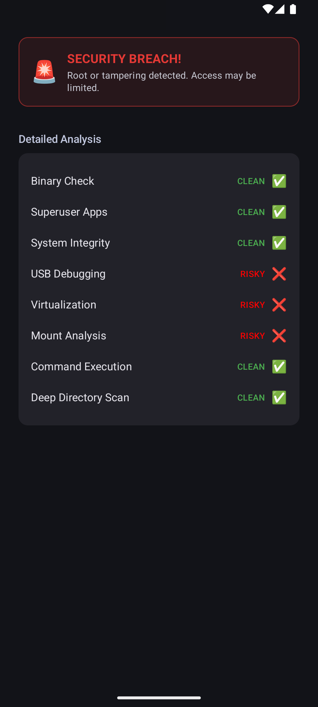

# Sentinel
Android security toolkit for protecting apps against tampering, reverse engineering, rooted devices and insecure environments.

# Root Detection

This kit lets you check if an Android device is rooted.



## Usage

### 1. Create Root

``` kotlin
val root: Root = Sentinel.Root.create(context = context)
```

### 2. Check root

``` kotlin
if (root.isRooted()) {
    println("Device is rooted")
} else {
    println("Device is safe")
}
```

### 3. Get detailed report (optional)

``` kotlin
val report = root.getReport()
```

## Summary

-   `isRooted()` → quick check\
-   `getReport()` → detailed info


## Dependency

Include the library in your **app module** `build.gradle`:

```gradle
implementation("com.github.ResulSilay:Sentinel:1.0.0.jitpack.beta")